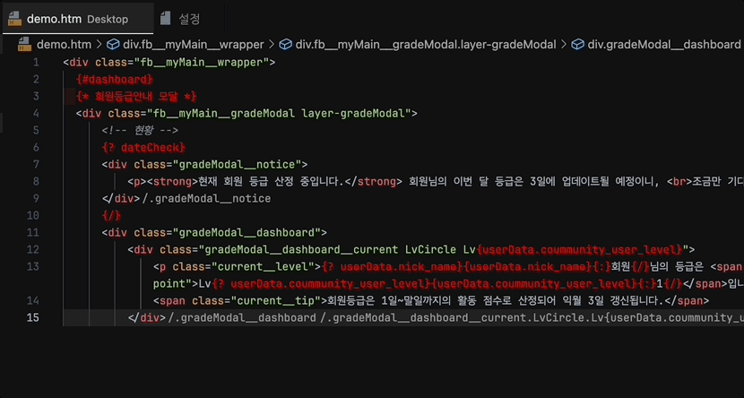

# Binding data Colorizer

- HTML에 데이터 바인딩 된 `핸들바(handlebar)` & `템플릿 언더바(template underscore)` 문법에 색상을 지정할 수 있습니다.

## 사용법

>Preference(설정) - 'Binding Data Colorizer' 검색 - 옵션 수정

 - `Debounce Duration` : 일정 시간(ms) 지난 후 색상을 반영합니다. (Default : 500ms)
 - `Background Color` : 바인딩 데이터의 배경 색상을 지정합니다. (Default : transparent)
 - `Color` : 바인딩 데이터의 폰트 색상을 지정합니다. (Default : red)

 ## 기능 ON/OFF 토글 단축키
- Windows: `Alt + T`
- MacOS: `Opt + T`
(사용자 키바인딩에서 편집 가능)

## 버그 및 기능 제안
ahuuae@icloud.com